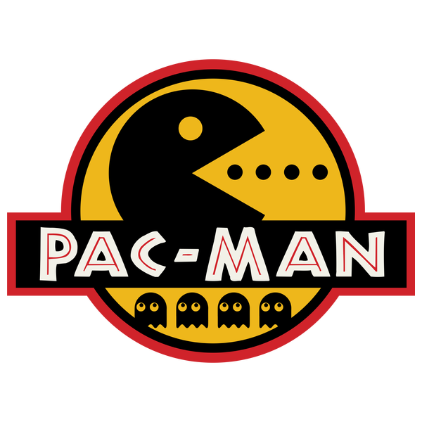
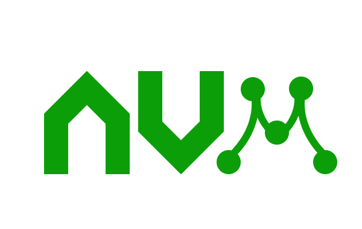

<div style="display: block;">
    
    
    
</div>


# Linux OS
1. Create file `touch bash.sh`
2. Remove file `rm bash.sh`
3. Rename file `mv bash.sh file.sh`
4. Move file (to parent folder) `mv file.sh ../`
5. Move nested folder: `mv -r ./nested ../../home`

6. Disk usage: `du -sh` 



# Pacman
1. Download package: `sudo pacman -S nodejs`

Download list:
```sh
sudo pacman -S npm
sudo pacman -S python
sudo pacman -S docker
sudo pacman -S git
sudo pacman -S psql
sudo pacman -S openssl
sudo pacman -S docker-compose
```



# NVM Node
* Must download with curl
* See the Initializer script

```
curl -o- https://raw.githubusercontent.com/nvm-sh/nvm/v0.39.5/install.sh | bash
```

Must activate it with [Nvm script](../addons/nvm_init.sh)

# Python Dependencies
```sh
pip show flask
pip show Flask-SQLAlchemy
```


# Vs Code
```
[Servers]
- Live Server
- Markdown Preview Enhanced

[Themes]
- Darcula Theme

[Icons]
- vscode-icons

[Java]
- Extension Pack for Java (White Cup Logo)
- Spring Initializr Java Support

[Python]
- Python (Python Logo)
```

