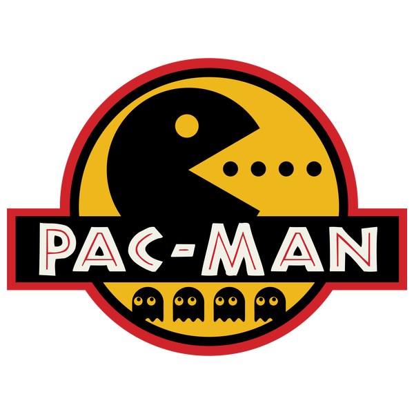

<div style="display: block;">
    
    
    
</div>

# Arch Linux Setup
1. Create file `touch bash.sh`
2. Remove file `rm bash.sh`
3. Rename file `mv bash.sh file.sh`
4. Move file (to parent folder) `mv file.sh ../`
5. Move nested folder: `mv -r ./nested ../../home`
6. Disk usage: `du -sh` 



# Pacman
1. Download package: `sudo pacman -S <package_name>`


# NVM Node
1. Must download with curl
2. See the Initializer script
* `curl -o- https://raw.githubusercontent.com/nvm-sh/nvm/v0.39.5/install.sh | bash`

Must activate it with [Nvm script](../arch_setup/server_nvm.sh)


# Code OSS
```
Servers
- Live Server
- Markdown Preview Enhanced

Themes
- Darcula Theme

Icons
- vscode-icons

Java
- Extension Pack for Java (White Cup Logo)
- Spring Initializr Java Support

Python
- Python (Python Logo)
```

